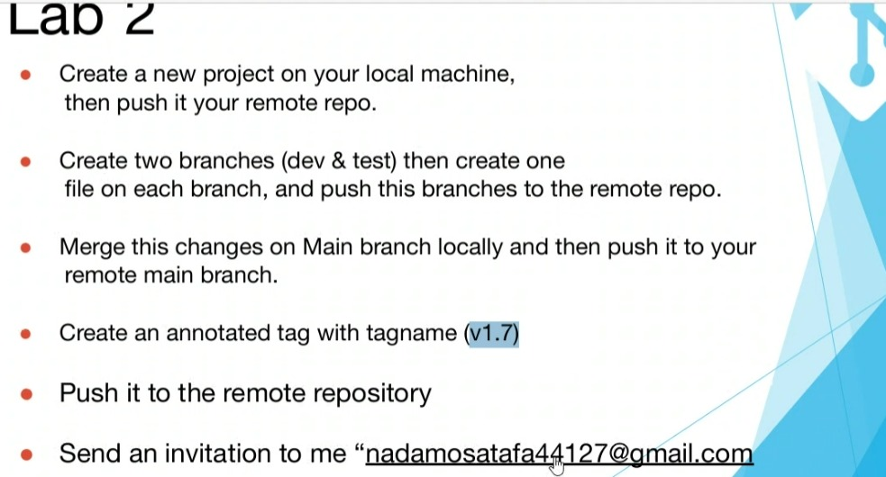

# 📁 ITI Version Control Task

This repository was created as part of the **Version Control** task during the **Intensive Training Program** at the [Information Technology Institute (ITI)](https://www.iti.gov.eg/).

---

## 🎓 Program Details

- **Track**: Front-End Cross Platform
- **Branch**: Cairo
- **Trainee**: Ahmed Bakr
- **Institute**: ITI – Information Technology Institute
- **Type**: Intensive Track

---

## 📝 Description

This task demonstrates the use of Git and GitHub for version control, including:

- Initializing a local repository
- Connecting to a remote repository
- Committing and pushing code
- Pulling changes from the remote repository

---

## 📌 Notes

This repository is part of the coursework and hands-on practice required for the program.
